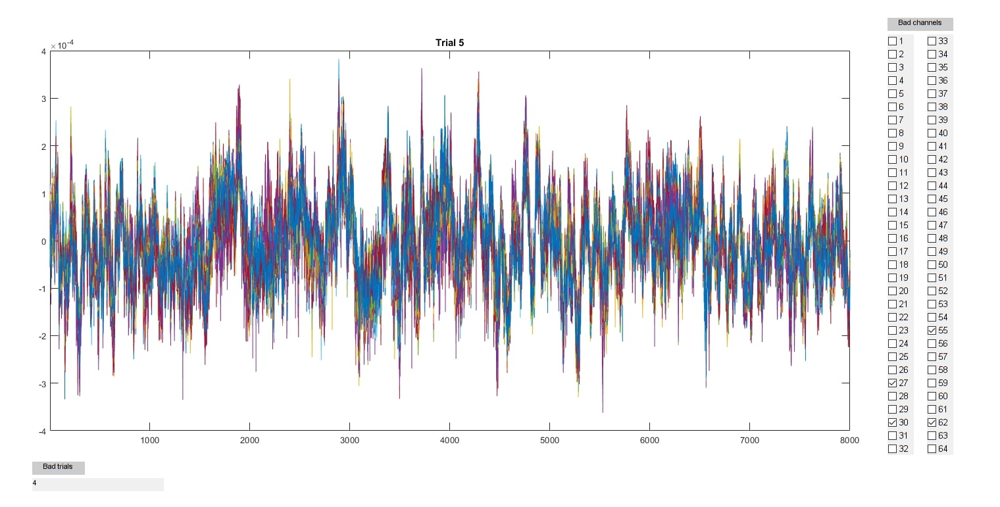

# ephys_tools
LFP and spiking pre-processing and general analyses

## LFP
- visualizeTrialData.m : GUI to visualize raw LFP data trial by trial, to mark bad channels and trials

## spiking
- alignSpikes.m : Finds and aligns spike times relative to an event/trial
- alignSpikes2.m : Aligns spike times based on 2 events
- circshuffle.m : Performs circular shuffling of spike times locked to event, to obtain a null distribution for hypothesis testing
